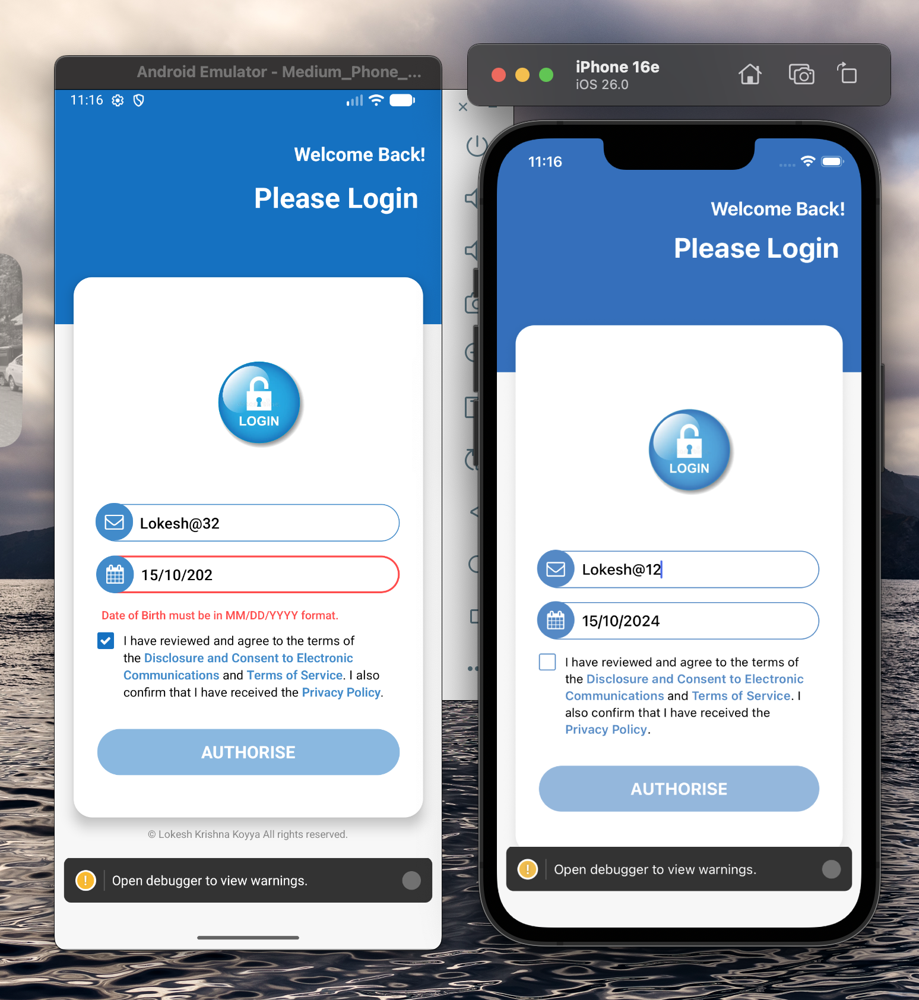

# 📱 Mobile Login Screen using React-Native

A cross-platform (iOS & Android) implementation of the  login interface built with React Native CLI.

---
## ✨ Live Preview

 

---

## ✨ Features Implemented

* **Responsive UI:** Fully fluid layout utilizing Flexbox, designed to adapt gracefully across various screen sizes.
* **iOS/Android Compatibility:** Styles and components are configured for uniform appearance and behavior on both platforms.
* **Custom Styling:** Includes custom typography (Poppins), shadow effects, and color schemes based on the provided UI design.
* **Input Handling:** Implements state management for user input (`username`, `DOB`) and includes options for disabling autocorrection.
* **Icon Integration:** Uses `react-native-vector-icons` (Font Awesome) for the envelope and lock icons.
* **Static Asset Loading:** Correct implementation for loading local `.jpg` signature asset.

## 🛠️ Tech Stack & Dependencies

| Category | Package / Tool | Purpose |
| :--- | :--- | :--- |
| **Framework** | React Native CLI | Barebones project structure for native control. |
| **Styling** | `StyleSheet` (Flexbox) | Core styling for responsive layout. |
| **Icons** | `react-native-vector-icons` | Provides Font Awesome icons (envelope, lock). |
| **Images** | `react-native-svg` | Used for potential future SVG assets (installed to manage C++ dependencies). |
| **Development** | Xcode, Android Studio | Native build environments. |

## ⚙️ Installation & Setup (Local)

To run this project locally, ensure you have Node, Watchman, and the React Native CLI installed.

1.  **Clone the Repository:**
    ```bash
    git clone https://github.com/Lokeshkrishna07/MobileLoginScreen.git
    cd MobileLoginScreen
    ```

2.  **Install Dependencies:**
    ```bash
    npm install
    ```

3.  **Install iOS Native Modules:**
    ```bash
    cd ios
    pod install
    cd ..
    ```

4.  **Run the App (Requires Xcode & Android Studio setup):**

    ```bash
    # For iOS Simulator
    npx react-native run-ios
    
    # For Android Emulator
    npx react-native run-android
    ```

***

*Developed by Lokesh Krishna. © 2025*
